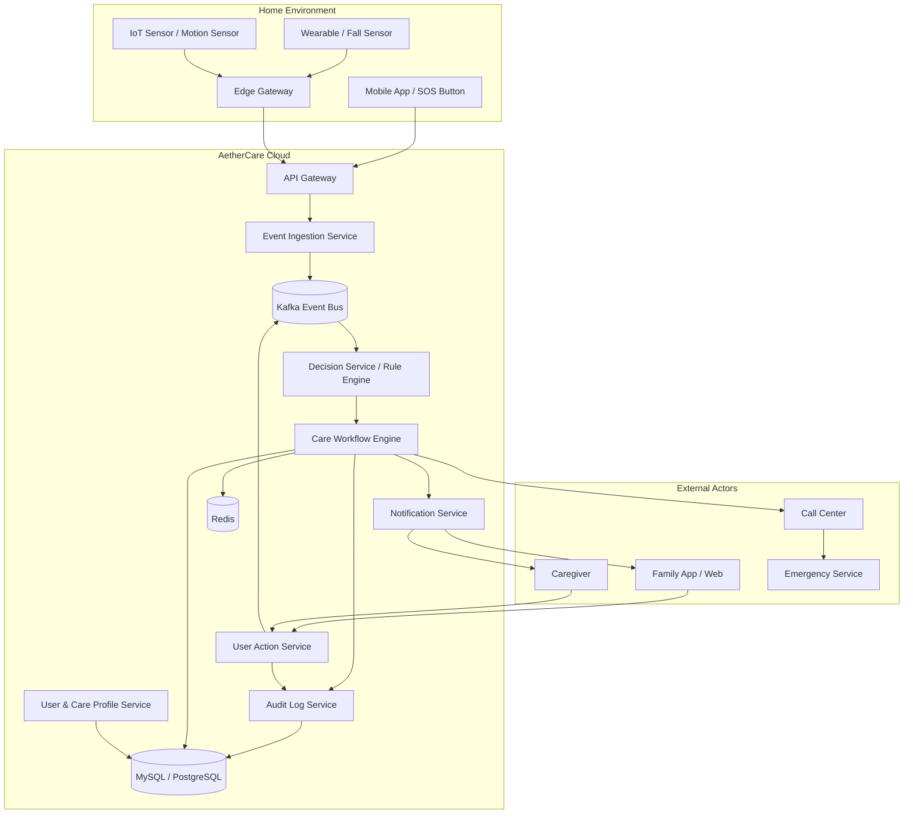
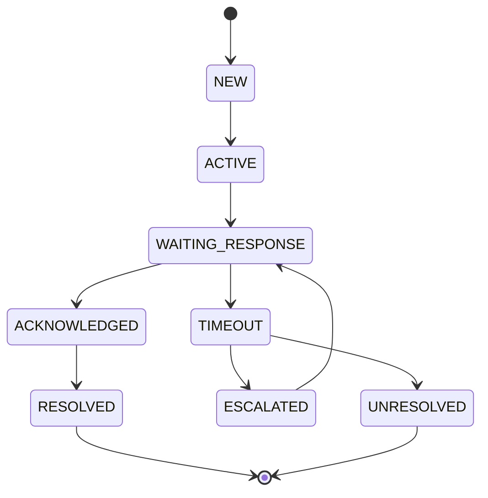

# AetherCare AI — Home Care Copilot

> Codex / AI Coding Agent 專用系統規劃與設計文件  
> Version: 0.1 MVP  
> Owner: 柳智有限公司 / AetherCare AI

---

## 1. 產品定位

AetherCare AI 不是單純的長照監控系統，而是 **Home Care Copilot / Care Execution Platform**。

核心主張：

> 我們不是只偵測風險，而是確保風險被處理。

產品要解決的不是「有沒有通知」，而是：

1. 是否知道異常事件發生？
2. 是否有人收到？
3. 是否有人確認？
4. 若沒有人處理，系統是否會自動升級？
5. 全流程是否留下責任鏈紀錄？

---

## 2. MVP 目標

第一階段只做一個核心閉環：

```text
疑似跌倒事件
→ 建立照護任務
→ 通知第一順位家屬
→ 等待 SLA 回應
→ 未回應則升級第二順位
→ 使用者操作回寫
→ 審計紀錄完整留存
```

MVP 不追求一開始就做最強 AI，而是先驗證：

> 事件 → 任務 → 通知 → 回應 → 升級 → 責任鏈

---

## 3. 核心設計原則

### 3.1 Event-driven

所有重要行為都要事件化，方便追蹤、擴充、重播與審計。

### 3.2 Workflow-first

通知不是終點，任務處理才是終點。

### 3.3 SLA-driven

每個照護任務都必須有 deadline。

### 3.4 Audit by default

所有重要狀態改變都必須寫入 audit log。

### 3.5 Rule-based before AI

MVP 先使用 rule engine。AI anomaly detection 放在第二階段。

---

## 4. 系統總覽架構



---

## 5. 建議服務拆分

MVP 可先使用 modular monolith，之後再拆 microservices。

### 5.1 MVP 模組

```text
aethercare-api
├── event-ingestion
├── decision
├── workflow
├── notification
├── action
├── audit
└── user-profile
```

### 5.2 未來微服務拆分

```text
aethercare-gateway
aethercare-ingestion
aethercare-decision
aethercare-workflow
aethercare-notification
aethercare-action
aethercare-audit
aethercare-user-profile
```

---

## 6. Workflow Engine 核心流程



### 6.1 主要流程

```text
1. 收到 care.event.created
2. Decision Service 判斷 risk_level
3. Workflow Engine 建立 workflow_instance
4. 建立第一個 care_task
5. Notification Service 發送通知
6. 等待使用者回應
7. 若 deadline 前回應 → workflow resolved
8. 若 deadline 後仍未回應 → timeout + escalation
9. 全流程寫入 audit log
```

---

## 7. SLA 設計

SLA 在本系統中的意思：

> 某個照護任務必須在多久內有人處理。

### 7.1 MVP SLA 範例

| Risk Level | Event Type | Level 1 | Level 2 | Level 3 |
|---|---|---:|---:|---:|
| HIGH | FALL_DETECTED | 30 秒 | 60 秒 | 120 秒 |
| MEDIUM | NO_ACTIVITY | 5 分鐘 | 10 分鐘 | 30 分鐘 |
| LOW | DAILY_REMINDER | 1 小時 | 2 小時 | 不升級 |

### 7.2 Timeout 行為

```text
if now > task.deadline_at and task.status == PENDING:
    mark task TIMEOUT
    create next escalation task
    notify next assignee
    write audit log
```

---

## 8. Kafka Topic 設計

### 8.1 MVP Topics

```text
care.event.created
care.workflow.started
care.task.created
care.notification.sent
care.action.received
care.audit.created
```

### 8.2 Future Topics

```text
care.task.timeout
care.task.escalated
care.workflow.resolved
care.workflow.unresolved
care.anomaly.detected
care.profile.updated
```

---

## 9. Event Schema

### 9.1 CareEventCreated

```json
{
  "eventId": "evt_001",
  "elderId": "elder_001",
  "source": "MOBILE_APP",
  "eventType": "FALL_DETECTED",
  "riskLevel": "HIGH",
  "occurredAt": "2026-04-27T12:00:00+08:00",
  "metadata": {
    "confidence": 0.92,
    "location": "living_room"
  }
}
```

### 9.2 CareActionReceived

```json
{
  "actionId": "act_001",
  "workflowId": "wf_001",
  "taskId": "task_001",
  "actorId": "user_001",
  "actionType": "CONFIRM_SAFE",
  "note": "已電話確認，長者安全",
  "createdAt": "2026-04-27T12:00:25+08:00"
}
```

---

## 10. DB Schema MVP

### 10.1 care_event

```sql
CREATE TABLE care_event (
  id BIGINT PRIMARY KEY,
  elder_id BIGINT NOT NULL,
  source VARCHAR(50) NOT NULL,
  event_type VARCHAR(50) NOT NULL,
  risk_level VARCHAR(20) NOT NULL,
  status VARCHAR(30) NOT NULL,
  occurred_at TIMESTAMP NOT NULL,
  created_at TIMESTAMP NOT NULL,
  updated_at TIMESTAMP NOT NULL
);
```

### 10.2 care_workflow_instance

```sql
CREATE TABLE care_workflow_instance (
  id BIGINT PRIMARY KEY,
  event_id BIGINT NOT NULL,
  elder_id BIGINT NOT NULL,
  workflow_type VARCHAR(50) NOT NULL,
  risk_level VARCHAR(20) NOT NULL,
  status VARCHAR(30) NOT NULL,
  current_level INT NOT NULL DEFAULT 1,
  started_at TIMESTAMP NOT NULL,
  completed_at TIMESTAMP NULL,
  created_at TIMESTAMP NOT NULL,
  updated_at TIMESTAMP NOT NULL,
  version INT NOT NULL DEFAULT 0
);
```

### 10.3 care_task

```sql
CREATE TABLE care_task (
  id BIGINT PRIMARY KEY,
  workflow_id BIGINT NOT NULL,
  event_id BIGINT NOT NULL,
  assignee_id BIGINT NOT NULL,
  assignee_type VARCHAR(30) NOT NULL,
  level INT NOT NULL,
  status VARCHAR(30) NOT NULL,
  deadline_at TIMESTAMP NOT NULL,
  acknowledged_at TIMESTAMP NULL,
  completed_at TIMESTAMP NULL,
  created_at TIMESTAMP NOT NULL,
  updated_at TIMESTAMP NOT NULL,
  version INT NOT NULL DEFAULT 0
);
```

### 10.4 care_action

```sql
CREATE TABLE care_action (
  id BIGINT PRIMARY KEY,
  workflow_id BIGINT NOT NULL,
  task_id BIGINT NOT NULL,
  actor_id BIGINT NOT NULL,
  action_type VARCHAR(50) NOT NULL,
  note TEXT NULL,
  created_at TIMESTAMP NOT NULL
);
```

### 10.5 care_audit_log

```sql
CREATE TABLE care_audit_log (
  id BIGINT PRIMARY KEY,
  workflow_id BIGINT NOT NULL,
  event_id BIGINT NOT NULL,
  actor_id BIGINT NULL,
  action VARCHAR(100) NOT NULL,
  message TEXT NOT NULL,
  created_at TIMESTAMP NOT NULL
);
```

### 10.6 care_contact_escalation

```sql
CREATE TABLE care_contact_escalation (
  id BIGINT PRIMARY KEY,
  elder_id BIGINT NOT NULL,
  contact_user_id BIGINT NOT NULL,
  level INT NOT NULL,
  channel VARCHAR(30) NOT NULL,
  sla_seconds INT NOT NULL,
  enabled BOOLEAN NOT NULL DEFAULT TRUE,
  created_at TIMESTAMP NOT NULL,
  updated_at TIMESTAMP NOT NULL
);
```

---

## 11. API 設計 MVP

### 11.1 建立事件

```http
POST /api/v1/care-events
Content-Type: application/json
```

```json
{
  "elderId": 1001,
  "source": "MOBILE_APP",
  "eventType": "FALL_DETECTED",
  "metadata": {
    "confidence": 0.92,
    "location": "living_room"
  }
}
```

### 11.2 使用者確認安全

```http
POST /api/v1/care-tasks/{taskId}/actions
Content-Type: application/json
```

```json
{
  "actorId": 2001,
  "actionType": "CONFIRM_SAFE",
  "note": "已確認安全"
}
```

### 11.3 查詢 Workflow 狀態

```http
GET /api/v1/workflows/{workflowId}
```

### 11.4 查詢責任鏈

```http
GET /api/v1/workflows/{workflowId}/audit-logs
```

---

## 12. Workflow Engine Pseudocode

### 12.1 Start Workflow

```java
public void startWorkflow(CareEvent event) {
    WorkflowInstance workflow = workflowRepository.create(event);

    EscalationContact contact = escalationService.findContact(
        event.getElderId(),
        1
    );

    CareTask task = taskRepository.create(
        workflow.getId(),
        event.getId(),
        contact.getContactUserId(),
        1,
        now().plusSeconds(contact.getSlaSeconds())
    );

    notificationService.notify(task);

    auditService.log(
        workflow.getId(),
        event.getId(),
        null,
        "TASK_CREATED",
        "Level 1 contact notified"
    );
}
```

### 12.2 Timeout Scanner

```java
@Scheduled(fixedDelay = 5000)
public void scanTimeoutTasks() {
    List<CareTask> tasks = taskRepository.findExpiredPendingTasks(now());

    for (CareTask task : tasks) {
        boolean locked = taskRepository.markTimeoutIfPending(task.getId());

        if (!locked) {
            continue;
        }

        escalationService.escalate(task);
    }
}
```

### 12.3 Escalate

```java
public void escalate(CareTask task) {
    WorkflowInstance workflow = workflowRepository.findById(task.getWorkflowId());
    int nextLevel = task.getLevel() + 1;

    EscalationContact nextContact = escalationService.findContact(
        workflow.getElderId(),
        nextLevel
    );

    if (nextContact == null) {
        workflowRepository.markUnresolved(workflow.getId());
        auditService.log(workflow, "UNRESOLVED", "No next escalation contact");
        return;
    }

    CareTask nextTask = taskRepository.create(
        workflow.getId(),
        workflow.getEventId(),
        nextContact.getContactUserId(),
        nextLevel,
        now().plusSeconds(nextContact.getSlaSeconds())
    );

    notificationService.notify(nextTask);
    auditService.log(workflow, "ESCALATED", "Escalated to level " + nextLevel);
}
```

---

## 13. 併發與一致性設計

### 13.1 防止重複 timeout

使用 conditional update：

```sql
UPDATE care_task
SET status = 'TIMEOUT', updated_at = NOW(), version = version + 1
WHERE id = :taskId
  AND status = 'PENDING'
  AND deadline_at < NOW();
```

只有 affected rows = 1 的 worker 可以繼續 escalation。

### 13.2 防止重複 action

```sql
UPDATE care_task
SET status = 'COMPLETED', completed_at = NOW(), updated_at = NOW()
WHERE id = :taskId
  AND status IN ('PENDING', 'ACKNOWLEDGED');
```

若 affected rows = 0，代表此 task 已 timeout、completed 或 cancelled。

### 13.3 Redis 使用場景

```text
workflow:lock:{workflowId}        防止同一流程重複處理
task:deadline:{taskId}            可選，做延遲任務輔助
elder:latest-status:{elderId}     長者即時狀態快取
```

---

## 14. Notification 設計

### 14.1 MVP Channels

```text
LINE Messaging API
SMS
Email
Mobile Push Notification
```

### 14.2 通知內容

通知不要只說「發生事件」，要直接提供 action buttons：

```text
AetherCare Alert
長者：王媽媽
事件：疑似跌倒
風險：HIGH
請於 30 秒內確認

[我已確認安全]
[需要協助]
[撥打電話]
```

---

## 15. Audit Log 設計

每一個重要節點都要記錄：

```text
EVENT_CREATED
WORKFLOW_STARTED
TASK_CREATED
NOTIFICATION_SENT
TASK_ACKNOWLEDGED
TASK_COMPLETED
TASK_TIMEOUT
TASK_ESCALATED
WORKFLOW_RESOLVED
WORKFLOW_UNRESOLVED
```

Audit log 是產品護城河的一部分，未來可用於：

1. 家屬信任
2. 長照機構管理
3. 保險合作
4. 法務責任釐清
5. SLA 報表

---

## 16. MVP 開發任務拆分

### Phase 1：核心事件閉環

- [ ] 建立 Spring Boot 專案
- [ ] 建立 DB schema
- [ ] 建立 care_event API
- [ ] 建立 workflow instance
- [ ] 建立 task
- [ ] 建立 notification stub
- [ ] 建立 audit log

### Phase 2：Action Callback

- [ ] 建立 task action API
- [ ] 完成 CONFIRM_SAFE 流程
- [ ] 完成 NEED_HELP 流程
- [ ] action 後更新 workflow 狀態
- [ ] action 後寫入 audit log

### Phase 3：SLA Timeout

- [ ] 建立 timeout scanner
- [ ] conditional update 防止重複 timeout
- [ ] timeout 後建立 level 2 task
- [ ] timeout 後寫入 audit log

### Phase 4：Dashboard

- [ ] 查詢長者目前狀態
- [ ] 查詢 workflow 狀態
- [ ] 查詢任務列表
- [ ] 查詢 audit timeline

### Phase 5：Demo

- [ ] 模擬 FALL_DETECTED 事件
- [ ] 發送第一順位通知
- [ ] 30 秒未回應自動升級
- [ ] 第二順位確認安全
- [ ] 顯示完整責任鏈

---

## 17. Codex 任務 Prompt 範本

### 17.1 建立 DB migration

```text
請根據 docs/aethercare_codex_system_design.md 的 DB Schema，使用 Liquibase 建立 MVP tables：care_event、care_workflow_instance、care_task、care_action、care_audit_log、care_contact_escalation。請使用 PostgreSQL 相容語法，並補上必要 index。
```

### 17.2 建立 Workflow Engine

```text
請根據 docs/aethercare_codex_system_design.md 實作 Workflow Engine MVP：
1. 收到 CareEvent 後建立 WorkflowInstance
2. 建立 Level 1 CareTask
3. 呼叫 NotificationService
4. 寫入 AuditLog
5. 提供 unit tests
請使用 Spring Boot 3.x、Java 21，並維持 clean architecture。
```

### 17.3 建立 Timeout Scanner

```text
請實作 CareTaskTimeoutScanner：
1. 每 5 秒掃描 deadline_at 已過期且 status=PENDING 的 task
2. 使用 conditional update 防止多 pod 重複處理
3. timeout 後建立下一層 escalation task
4. 若沒有下一層聯絡人，workflow 標記為 UNRESOLVED
5. 補上整合測試
```

### 17.4 建立 Action API

```text
請建立 POST /api/v1/care-tasks/{taskId}/actions：
1. 支援 CONFIRM_SAFE、NEED_HELP
2. CONFIRM_SAFE 會完成 task 並 resolve workflow
3. NEED_HELP 會立即 escalation
4. 所有動作都要寫入 care_action 與 care_audit_log
5. 補上 controller、service、repository、test
```

---

## 18. 驗收標準

### 18.1 功能驗收

- [ ] 可以建立 FALL_DETECTED 事件
- [ ] 系統會建立 workflow instance
- [ ] 系統會建立 level 1 task
- [ ] 系統會發送 notification stub
- [ ] 30 秒未處理會自動升級 level 2
- [ ] 使用者確認後 workflow 會 RESOLVED
- [ ] audit timeline 可完整查詢

### 18.2 技術驗收

- [ ] 所有狀態轉換都有 transaction 保護
- [ ] timeout scanner 在多 pod 下不會重複升級
- [ ] action API 不會重複完成同一個 task
- [ ] 所有核心流程都有 unit test
- [ ] 所有重要行為都有 audit log

---

## 19. 非目標範圍

MVP 暫時不做：

```text
1. 真正 AI 模型訓練
2. Camera Vision
3. 醫療診斷
4. 119 自動撥打
5. 保險 API
6. 長照機構多租戶 SaaS
7. 複雜排班系統
```

---

## 20. 第二階段方向

```text
1. Anomaly Detection：根據長者生活模式判斷異常
2. Multi-signal Fusion：手機、穿戴、環境 sensor 整合
3. Temporal / Durable Workflow：取代簡易 scanner
4. Multi-tenant SaaS：給長照機構使用
5. SLA Dashboard：回應時間、超時率、升級率
6. Insurance Integration：提供照護行為證據資料
```

---

## 21. 工程備註

建議技術棧：

```text
Java 21
Spring Boot 3.x
PostgreSQL / MySQL
Redis
Kafka
Liquibase
Docker
Kubernetes
Prometheus / Grafana
```

建議 coding style：

```text
1. Domain-first package structure
2. Service method 必須有 transaction boundary
3. Repository update 必須支援 conditional update
4. Event payload 使用 immutable DTO
5. 所有狀態 enum 化
6. 所有 workflow 狀態轉移集中管理
```

---

## 22. 最重要的產品信念

AetherCare 的核心不是「監控」，而是「照護執行」。

```text
市場上的產品在回答：發生什麼？
AetherCare 要回答：誰會處理？多久內處理？沒處理怎麼辦？
```

